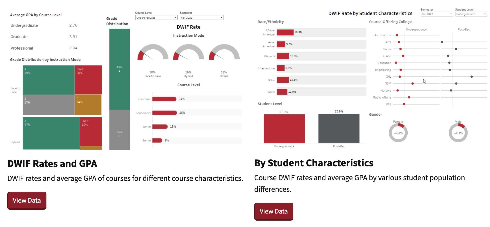

# About

This folder contains two dashboards I built at the University of Houston. The first one is called 'DWIF Rates and GPA by course characteristics',
and the second one is called 'DWIF Rates and GPA by student characteristics'.  DWIF means unsatisfactory grades including D, Withdraw, Incomplete, and F grades.

The first dashboard shows the relationship between DWIF rates and course characteristics such as instruction mode, course level, and core. 
The second dashboard shows the relationship between DWFI rates and student characteristics such as gender, student classification, race/ethnicity, and full-time/part-time status.

## Files
1. `dashboard1.pdf` - this is my presentation of the first dashboard (by course characteristics) to TAIR (Texas Association for Institutional Research) Annual Conference.
2. `dashboard2.pdf` - this is a demo of the second dashboard (by student characteristics)
