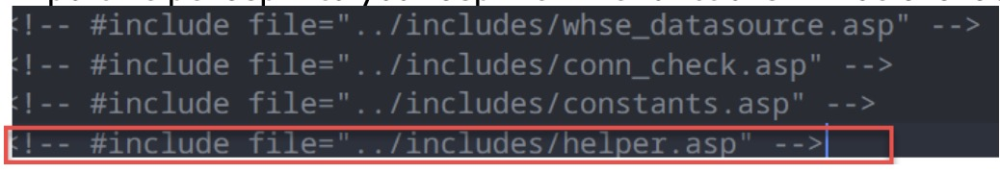
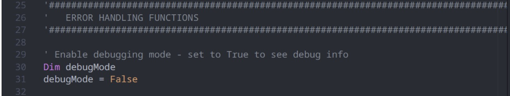
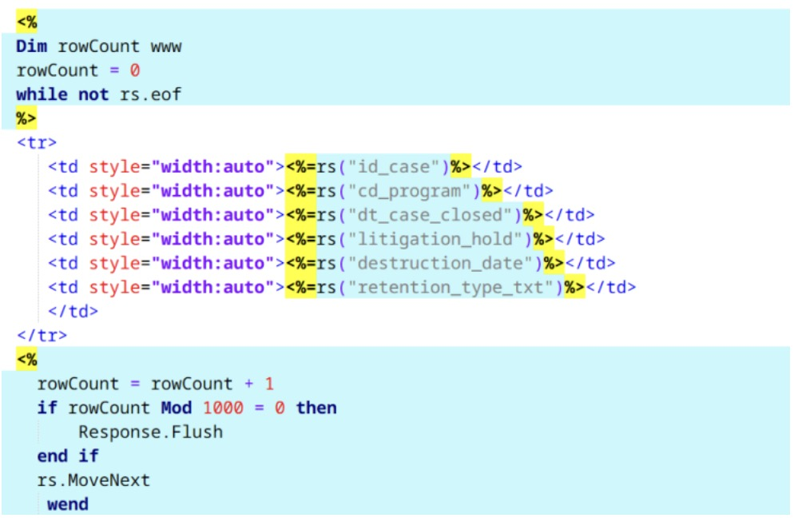

# About

This project creates a series of helper functions and subprocedures in VBScript to make my felllow analysts job easier.
Currently our tech stack for data warehouse front-end reports includes:

1. HTML/CSS for the front end
2. VBScript for the server logic
3. SQL/PLSQL for data retrieval from the data warehouse

But in our dev work, we are frequently faced with challenges due to

1. VBScript being an obsolete language (scanty documentation)
2. Difficulty in translation in data types particularly dates between server, vbscript, html/excel (final results)

So I wanted to make the dev work smoother for my fellow analysts/developers. The following section is the email I sent to my team to describe the challenges in our dev work and how this suite of helper methods can be helpful in mitigating these challenges.

---

Hello Team,

I sometimes get frustrated with asp dev work because of the lack of documentation, and debugging is often hit and miss.

So, I wrote some helper functions to serve two purposes:

1. Make debugging more transparent during asp dev
2. Reduce the # of crashing reports (thereby reducing # of reports mailbox emails)

I included detailed comments including usage examples above each function/sub procedure. I tried to be thorough in my testing and everything seemed to be working when I tested, but I can’t guarantee that everything will work for you. If you are interested, keep reading.

### Q: How to get started?

Import helper.asp into your asp file. The functions will be available for you to use.



Commenting out `Response.ContentType = "application/vnd.ms-excel"` is necessary for debugging, but often insufficient. Instead, when you start developing, set debugMode = True in your asp file (see sample_asp.asp). This would print additional info, e.g., variable values, the entire SQL string, etc. in the browser to help you debug. When done debugging, set it back to False, asp will generate Excel as usual.



### Q:What helper functions are offered in helper.asp?

- `ExecuteQuery`: This is essentially the ‘objConn.execute’ plus exception handling. If there is a query execution error, it will log the error and print related error information along with the SQL query in the browser by calling the LogError subroutine (when debugMode is set to True).
  Before: `set rs = objConn.execute(strSQL)` -> Now: `set rs = ExecuteQuery(strSQL)`

- `FlushRecordset`: This subroutine helps with flushing data from memory to the browser when you need to pull a large dataset and it is bogging down the memory. Instead of doing below to flush, you can just call FlushRecordset(1000) and be done.

 
 
- `SafeGetField`: This function addresses the issue of using rs(‘column_name’) to extract a value out of rs but often crashes the report.  I think we have gotten enough of those pesky reports mailbox emails 😢. With this function, you can set a fallback value and the report will render instead of crashing. The fallback would still allow us to identify those abnormal cases later. 
 
Imagine a bad date ‘0021-08-01’, instead of crashing a report entirely, we can have a fallback like ‘1990-01-01’ or something, the report will continue to run. I think this may reduce the # of occurrences of those annoying emails from frustrated report users. 
 - Before: `rs(‘dt_occurred’)`       
 - Now: `SafeGetField(rs, ‘date_occurred’, ‘1990-01-01’)`.
 
```sql
-- 112
select
    id_time_load,
    DT_PP_LEGACT_OUTCOME
  from caps.pp_leg_action_hist_dim
where substr(to_char(DT_PP_LEGACT_OUTCOME, 'MM/DD/YYYY'), -4, 1) = 0
;
 
select                                                                   
      id_time_load,                                                           
      DT_SA_PLCMT_CRGVR_DISCUSS "date"                                               
 from caps.SA_PLCMT_HIST_DIM                                        
 where substr(to_char(DT_SA_PLCMT_CRGVR_DISCUSS, 'MM/DD/YYYY'), -4, 1)  = '0' 
      and id_time_load > 100400;    
``` 
 
- `GetSingleValue`: This function is intended for executing sql query to get single values to be assigned to variables such as v_timeload, v_hist_timeload, etc. This will use SafeGetField to retrieve those single values from rs and as such you can set a fallback value.   Example:   v_timeload = GetSingleValue(strSQL, 100400).
 
- `LogError:` This sub procedure is responsible for printing error messages when ExecuteQuery fails. You don’t call it directly, but it is used by ExecuteQuery.
 
- `GetStyle:` This function groups all styling information to minimize the usage of inline style like `‘style=”border:1px solid black”` or `‘mso-number-format:’` for leading zeros, percentages, currency formats in excel, because inline style can make asp look messy.
 
All you need to do is put `<%=GetStyle(“leading-zeros”)%>` in the `<style></style>` inside html head tag. Then add corresponding class to the right column (see the available classes in the helper.asp file).

```html
<head>
  <style>
    <%=GetStyle(“leading-zeros”)%>
    <%=GetStyle(“percentage-1”)%>
    <%=GetStyle(“currency-1”)%>
  </style>
</head>
………………………………………………………
<td class="”leading-zeros”"></td>
<td class="”percentage-1”"></td>
<td class="”currency-1”"></td>
```

- `SafeDateComparison & SafeComparisonToDate:` These two functions address the vexing problem of to_date() function in sql but often fails when rendering in ASP.
  Comparison between two dates where one is null would produce unpredictable results. We want to make sure no null dates when comparing dates.
  When using to_date() sql function in ASP, make sure date format is supplied (instead of to_date(“2021-08-01”), use to_date(“2021-08-21”, “YYYY-MM-DD”).

If `to_date()` function is present, then use SafeComparisonToDate; otherwise, use SafeDateComparison

```sql
Before: a.dt_occurred < b.dt_entered -> Now: SafeDateComparison(dt_occurred, dt_entered, “<”, “a”, “b”)
Before: To_date(a.dt_occurred) < to_date(b.dt_entered) ->  Now: SafeDateComparison(dt_occurred, dt_entered, “<”, “a”, “b”, “YYYY-MM-DD”)
```

These two functions are probably not needed but included for your reference.

Among above, SafeGetField is probably most useful for our needs. We can keep adding more helper functions as the need arises.
