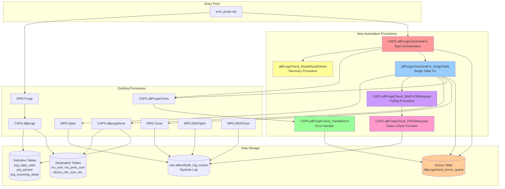
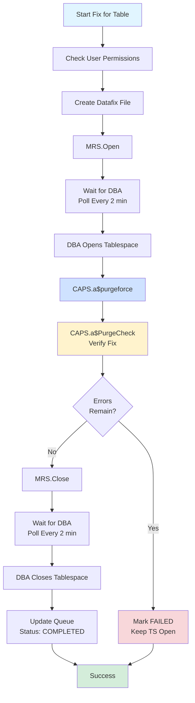
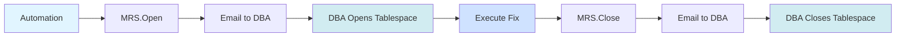

# Purge Data Fix Automation - Procedure Flow Diagram

## Main Flow

```mermaid
flowchart TD
    Start([Monthly MDC Process]) --> SumPurge["sum_purge.sql<br/>Entry Point"]

    SumPurge --> MRSPurge["MRS.Purge<br/>Orchestrates Purge"]
    MRSPurge --> A$Purge["CAPS.a$purge<br/>Main Purge Procedure"]
    A$Purge --> UpdateDef["Update Definition Tables<br/>Set ind_mrs_process bits"]

    UpdateDef --> AutoFix["CAPS.a$PurgeCheckAndFix<br/>Main Orchestration"]

    AutoFix --> ResetStuck["Reset Stuck Entries<br/>a$PurgeCheck_<br>ResetStuckEntries"]
    ResetStuck --> Check1["CAPS.a$PurgeCheck<br/>Detect Errors"]

    Check1 --> HandleError["CAPS.a$PurgeCheck_<br>HandleError<br/>Log to Queue Table"]
    HandleError --> QueueTable[("Queue Table<br/>a$purgecheck_errors_queue")]

    QueueTable --> ProcessQueue{Process Queue?}

    ProcessQueue -->|For Each Table| SingleTable["Fix Single Table<br/>a$PurgeCheckAndFix_<br>SingleTable"]

    SingleTable --> CreateFile["Create Datafix File<br/>UTL_FILE"]
    CreateFile --> MRSOpen["MRS.Open<br/>Request Tablespace Open"]
    MRSOpen --> WaitOpen["Wait for DBA<br/>Poll Every 2 min"]

    WaitOpen --> DBAOpen["MRS.DBAOpen<br/>DBA Opens Tablespace"]

    DBAOpen --> PurgeForce["CAPS.a$purgeforce<br/>Execute Fix"]
    PurgeForce --> Verify1["CAPS.a$PurgeCheck<br/>Verify Fix"]
    Verify1 --> CheckQueue{Errors Remain?}

    CheckQueue -->|Yes| FailStatus["Mark as FAILED<br/>Keep Tablespace Open"]
    CheckQueue -->|No| MRSClose["MRS.Close<br/>Request Tablespace Close"]

    MRSClose --> WaitClose["Wait for DBA<br/>Poll Every 2 min"]
    WaitClose --> DBAClose["MRS.DBAClose<br/>DBA Closes Tablespace"]

    DBAClose --> UpdateQueue["Update Queue Table<br/>Status = COMPLETED"]
    UpdateQueue --> NextTable{More Tables?}

    NextTable -->|Yes| SingleTable
    NextTable -->|No| FinalCheck["CAPS.a$PurgeCheck<br/>Final Verification"]

    FinalCheck --> SummaryEmail["Send Summary Email"]
    SummaryEmail --> End([Process Complete])

    FailStatus --> End
    ProcessQueue -->|No Errors| FinalCheck

    style Start fill:#e1f5ff
    style End fill:#d4edda
    style QueueTable fill:#fff3cd
    style SingleTable fill:#f8d7da
    style DBAOpen fill:#d1ecf1
    style DBAClose fill:#d1ecf1
    style PurgeForce fill:#cfe2ff
```

## Procedure Relationships

```mermaid
graph TB
    subgraph "Entry Point"
        SumPurge[sum_purge.sql]
    end

    subgraph "Existing Procedures"
        MRSPurge[MRS.Purge]
        A$Purge[CAPS.a$purge]
        A$PurgeForce[CAPS.a$purgeforce]
        A$PurgeCheck[CAPS.a$PurgeCheck]
        MRSOpen[MRS.Open]
        MRSClose[MRS.Close]
        DBAOpen[MRS.DBAOpen]
        DBAClose[MRS.DBAClose]
    end

    subgraph "New Automation Procedures"
        AutoFix["CAPS.a$PurgeCheckAndFix<br/>Main Orchestration"]
        SingleTable["a$PurgeCheckAndFix_SingleTable<br/>Single Table Fix"]
        HandleError["CAPS.a$PurgeCheck_HandleError<br/>Error Handler"]
        WaitTablespace["CAPS.a$PurgeCheck_WaitForTablespace<br/>Polling Procedure"]
        PollTablespace["CAPS.a$PurgeCheck_PollTablespace<br/>Status Check Function"]
        ResetStuck["a$PurgeCheck_ResetStuckEntries<br/>Recovery Procedure"]
    end

    subgraph "Data Storage"
        QueueTable[(Queue Table<br/>a$purgecheck_errors_queue)]
        DefTables[(Definition Tables<br/>prg_caps_case<br/>prg_person<br/>prg_incoming_detail)]
        DestTables[(Destination Tables<br/>inv_sum, inv_princ_sum<br/>afcars_cfsr_sum, etc.)]
        LogMaster[(ram.a$rectifydb_log_master<br/>Episode Log)]
    end

    SumPurge --> MRSPurge
    SumPurge --> AutoFix

    MRSPurge --> A$Purge
    A$Purge --> DefTables
    A$Purge --> DestTables

    AutoFix --> ResetStuck
    AutoFix --> A$PurgeCheck
    AutoFix --> SingleTable
    AutoFix --> QueueTable

    A$PurgeCheck --> HandleError
    HandleError --> QueueTable

    SingleTable --> MRSOpen
    SingleTable --> WaitTablespace
    SingleTable --> A$PurgeForce
    SingleTable --> A$PurgeCheck
    SingleTable --> MRSClose
    SingleTable --> QueueTable

    MRSOpen --> LogMaster
    MRSClose --> LogMaster
    DBAOpen --> LogMaster
    DBAClose --> LogMaster

    WaitTablespace --> PollTablespace
    PollTablespace --> LogMaster

    A$PurgeForce --> DestTables
    A$PurgeForce --> DefTables

    style AutoFix fill:#ff9999
    style SingleTable fill:#99ccff
    style QueueTable fill:#ffcc99
    style HandleError fill:#99ff99
    style WaitTablespace fill:#cc99ff
    style PollTablespace fill:#ff99cc
    style ResetStuck fill:#ffff99
```

## Simplified High-Level Flow

```mermaid
flowchart LR
    A[sum_purge.sql] --> B[MRS.Purge]
    B --> C[CAPS.a$PurgeCheckAndFix]
    C --> D[Detect Errors]
    D --> E[Queue Errors]
    E --> F[Process Queue]
    F --> G[Fix Each Table]
    G --> H[Verify Fix]
    H --> I[Send Summary]

    style A fill:#e1f5ff
    style C fill:#ff9999
    style G fill:#99ccff
    style I fill:#d4edda
```

## Single Table Fix Flow

```mermaid
flowchart TD
    Start[Start Fix for Table] --> CheckPerm[Check User Permissions]
    CheckPerm --> CreateFile[Create Datafix File]
    CreateFile --> OpenTS[MRS.Open]
    OpenTS --> WaitOpen[Wait for DBA<br/>Poll Every 2 min]
    WaitOpen --> DBAOpen[DBA Opens Tablespace]
    DBAOpen --> RunFix[CAPS.a$purgeforce]
    RunFix --> Verify[CAPS.a$PurgeCheck<br/>Verify Fix]
    Verify --> ErrorsRemain{Errors<br/>Remain?}

    ErrorsRemain -->|Yes| MarkFailed[Mark FAILED<br/>Keep TS Open]
    ErrorsRemain -->|No| CloseTS[MRS.Close]

    CloseTS --> WaitClose[Wait for DBA<br/>Poll Every 2 min]
    WaitClose --> DBAClose[DBA Closes Tablespace]
    DBAClose --> UpdateQueue[Update Queue<br/>Status: COMPLETED]
    UpdateQueue --> End[Success]

    MarkFailed --> End

    style Start fill:#e1f5ff
    style RunFix fill:#cfe2ff
    style Verify fill:#fff3cd
    style End fill:#d4edda
    style MarkFailed fill:#f8d7da
```

## Tablespace Management Flow

```mermaid
flowchart LR
    A[Automation] --> B[MRS.Open]
    B --> C[Email to DBA]
    C --> D[DBA Opens Tablespace]
    D --> E[Execute Fix]
    E --> F[MRS.Close]
    F --> G[Email to DBA]
    G --> H[DBA Closes Tablespace]

    style A fill:#e1f5ff
    style D fill:#d1ecf1
    style H fill:#d1ecf1
    style E fill:#cfe2ff
```
